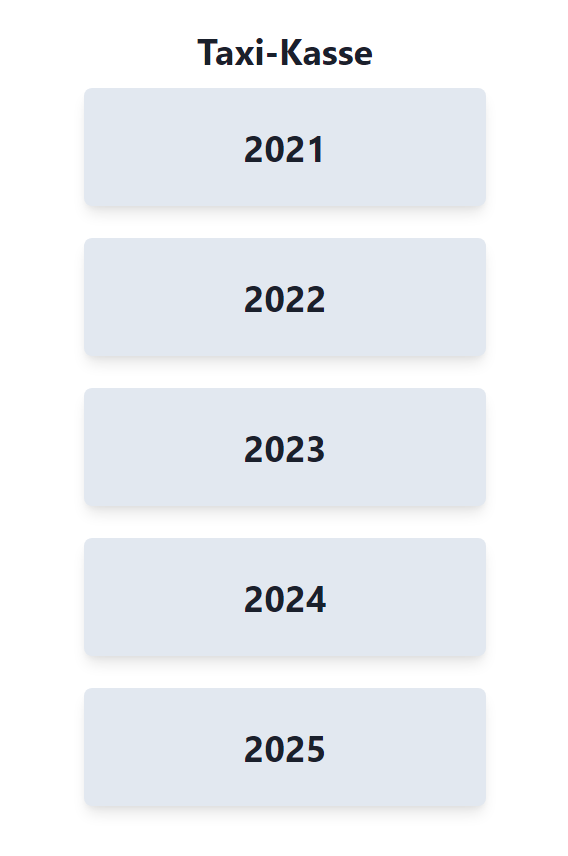

This is a minimal [Blitz.js](https://github.com/blitz-js/blitz) app.

# **taxi-kasse**

You can create for the years 2021, 2022, 2023, 2024, 2025 the PDFs in this style:

Screenshots of the pages:

